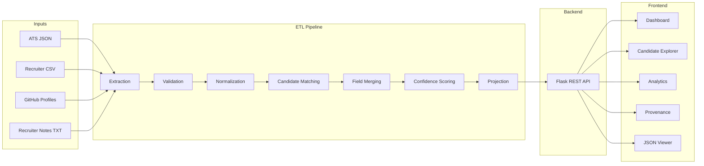
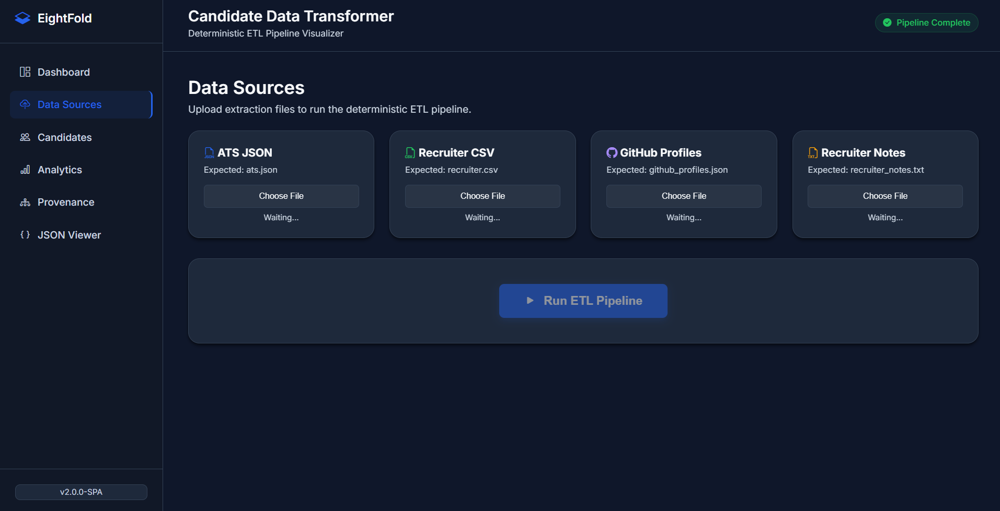
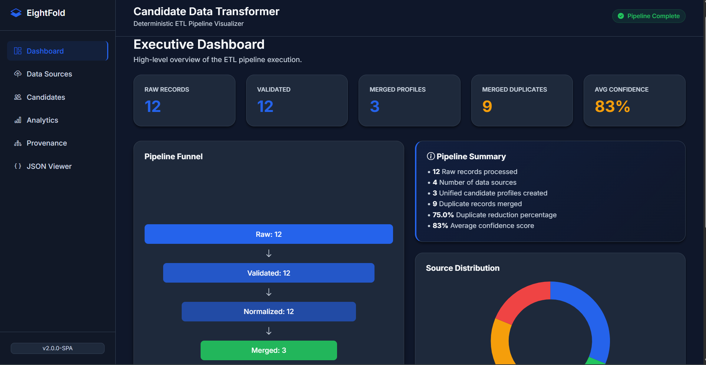
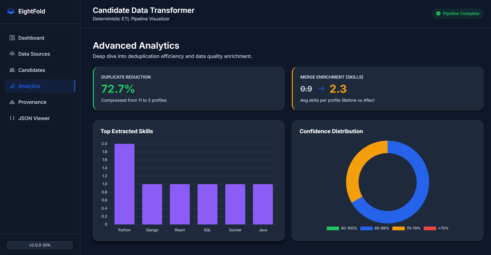
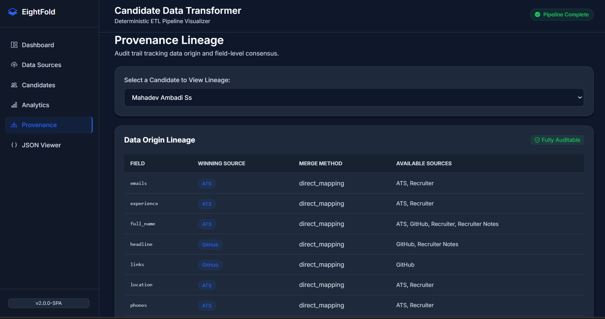
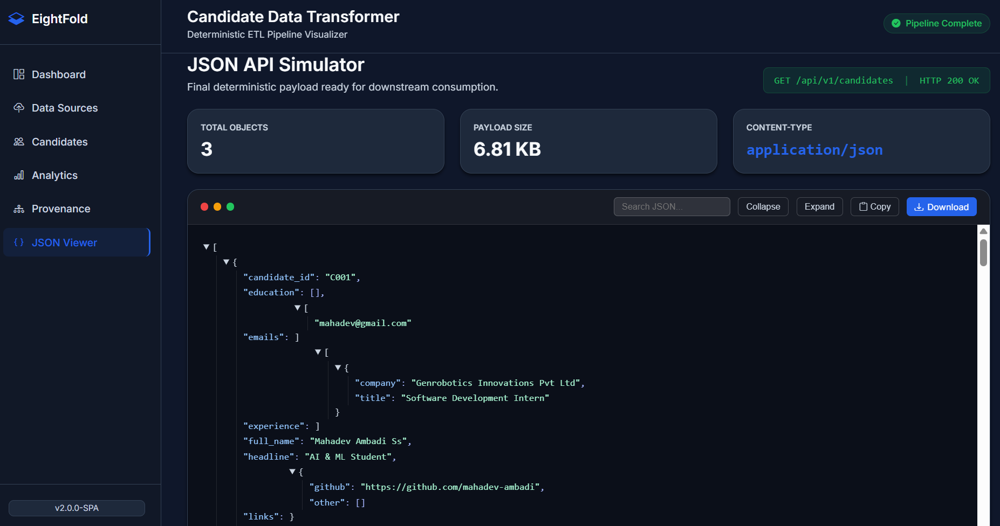

# Candidate Data Transformer


## 📌 Project Overview
The **Candidate Data Transformer** is a deterministic, enterprise-grade ETL (Extract, Transform, Load) pipeline designed to aggregate, normalize, deduplicate, and score candidate profiles from disparate HR systems. It ingests data from raw ATS exports, recruiter notes, CSV files, and GitHub profiles, resolving conflicts through a weighted Confidence Engine, and projects the final unified candidate profiles into a standardized API-ready JSON payload through an interactive web dashboard.

## ✨ Features
- **Multi-Source Extraction:** Polyglot adapters supporting `.csv`, `.json`, and `.txt` ingestion.
- **Data Normalization:** Robust schema enforcement and data standardization via Pydantic.
- **Deterministic Deduplication:** A highly configurable `MergeEngine` that identifies duplicate candidates across systems and intelligently merges their fields.
- **Confidence Scoring:** A mathematical `ConfidenceEngine` that grades profiles based on Source Reliability, Data Provenance Agreement, and Profile Completeness.
- **Cryptographic Provenance Lineage:** Every single field retains an audit trail detailing its exact origin and extraction method.
- **Interactive UI Dashboard:** A responsive Flask-powered web application for uploading data sources, visualizing ETL execution, exploring merged candidates, auditing provenance, and exporting the final JSON payload.

## 🏗️ Architecture
The backend strictly enforces separation of concerns. Data flows deterministically without side effects:
1. **Adapters:** Extract data from source files.
2. **Validator:** Strips invalid records natively using Pydantic.
3. **Normalizer:** Cleans unstructured strings into standardized formats.
4. **Merge Engine:** Identifies candidate overlap and resolves field-level conflicts.
5. **Confidence Engine:** Scores the resulting merged profiles.
6. **Projection Layer:** Strips internal metadata to generate clean API payloads.

## 🔄 System Architecture



## 📁 Folder Structure
```text
candidate-data-transformer/
│
├── static/
├── templates/
├── uploads/
├── src/
│   ├── adapters/
│   ├── merger/
│   ├── validator/
│   ├── projection/
│   ├── confidence/
│   └── ...
│
├── server.py
├── main.py
├── requirements.txt
└── README.md
```

## 🚀 Installation

1. **Clone the repository:**
   ```bash
   git clone https://github.com/mahadev-ambadi/candidate-data-transformer.git
   cd candidate-data-transformer
   ```

2. **Create a virtual environment:**
   ```bash
   python -m venv venv
   source venv/bin/activate  # On Windows use `venv\Scripts\activate`
   ```

3. **Install dependencies:**
   ```bash
   pip install -r requirements.txt
   ```
*(Note: requires `flask`, `flask-CORS` ,`pandas`, and `pydantic`)*

## ⚙️ Running the Project

1. Install the required dependencies:

```bash
pip install -r requirements.txt
```

2. Start the Flask server:

```bash
python server.py
```

3. Open your browser and navigate to:

```
http://127.0.0.1:5000
```

---

## 📊 Dashboard Overview

The application is powered by a Flask backend with a responsive JavaScript frontend. Users can upload multiple data sources, execute the deterministic ETL pipeline, and explore the unified candidate profiles through interactive dashboards.

- **Data Sources:** Upload structured (JSON, CSV) and unstructured (TXT) candidate data files directly from the UI to trigger the ETL pipeline.
- **Executive Dashboard:** Displays pipeline metrics including raw records, validated records, merged profiles, confidence scores, duplicate reduction, source distribution, and pipeline summary.
- **Candidate Explorer:** Browse unified candidate profiles with searchable cards showing contact details, experience, skills, confidence score, and merged information.
- **Analytics:** Interactive charts highlighting duplicate reduction, source contributions, skill enrichment, confidence distribution, and ETL performance metrics.
- **Provenance:** Complete audit trail showing the origin, extraction method, and lineage of every field merged into the final candidate profile.
- **JSON API Viewer:** Inspect, search, copy, and download the final deterministic JSON payload generated by the ETL pipeline, simulating a production-ready REST API response.

---

## 🚀 Workflow

1. Upload candidate data files (ATS JSON, Recruiter CSV, GitHub Profiles JSON, and Recruiter Notes TXT).
2. Execute the deterministic ETL pipeline.
3. Validate and normalize incoming records.
4. Merge duplicate candidates using deterministic matching rules.
5. Calculate confidence scores and preserve complete provenance.
6. Explore the unified candidate profiles through the interactive dashboard
7. Export or download the final standardized JSON payload for downstream applications.

## 📂 Supported Input Formats

| Source | Format | Type |
|---------|---------|------|
| ATS Export | JSON | Structured |
| Recruiter Database | CSV | Structured |
| GitHub Profiles | JSON | Structured |
| Recruiter Notes | TXT | Unstructured |

## 🔌 REST API Endpoints

| Endpoint | Description |
|-----------|-------------|
| /api/run | Execute ETL Pipeline |
| /api/dashboard | Dashboard Metrics |
| /api/candidates | Unified Candidate Profiles |
| /api/analytics | Analytics Data |
| /api/provenance | Provenance Information |
| /api/json | Final JSON Payload |

## 🖼️ Application Screenshots

---

### 📤 Upload Candidate Data



---

### 📊 Executive Dashboard

Displays pipeline execution statistics, duplicate reduction, confidence scores, and source metrics.



---

### 📈 Analytics Dashboard

Visualizes ETL performance, duplicate reduction, skill distribution, confidence distribution, and source contributions.



---

### 🔍 Provenance Viewer

Displays complete field-level lineage showing where every piece of candidate data originated.



---

### 📄 JSON Output Viewer

Inspect and download the final standardized API-ready JSON payload.




## 🔮 Future Improvements
If transitioning to a live enterprise environment handling millions of records daily, the following architecture upgrades are recommended:
- **Locality Sensitive Hashing (LSH):** Implement blocking in the `MergeEngine` to reduce $O(N^2)$ candidate matching complexity.
- **Dead Letter Queues (DLQ):** Route validation failures to a dedicated queue/file for data engineering audits.
- **Temporal Conflict Resolution:** Extract timestamps from source systems to prioritize data freshness during field merging.
- **Event-Driven Streaming:** Transition from batch processing to an Apache Kafka / AWS Kinesis real-time stream.

## 🛠️ Technologies Used

- **Python 3.10+** – Core ETL pipeline and data processing
- **Flask** – Backend REST API and web server
- **Flask-CORS** – Cross-origin API support
- **Pydantic** – Data validation and schema enforcement
- **Pandas** – Data manipulation and ETL transformations
- **HTML5** – Frontend structure
- **CSS3** – Responsive UI styling
- **JavaScript (ES6)** – Interactive frontend and API integration
- **Chart.js** – Interactive dashboards and analytics visualizations
- **JSON & CSV** – Structured data ingestion
- **Git & GitHub** – Version control and collaboration

## 📄 License
This project is licensed under the MIT License - see the LICENSE file for details.
