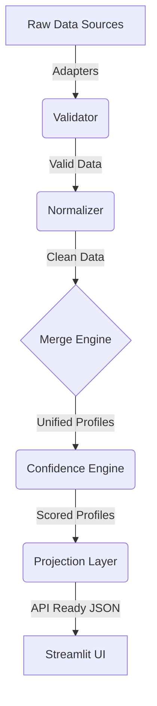

# Candidate Data Transformer


## 📌 Project Overview
The **Candidate Data Transformer** is a deterministic, enterprise-grade ETL (Extract, Transform, Load) pipeline designed to aggregate, normalize, deduplicate, and score candidate profiles from disparate HR systems. It ingests data from raw ATS exports, recruiter notes, CSV files, and GitHub profiles, resolving conflicts through a weighted Confidence Engine, and projects the final unified profiles into an API-ready JSON payload.

## ✨ Features
- **Multi-Source Extraction:** Polyglot adapters supporting `.csv`, `.json`, and `.txt` ingestion.
- **Data Normalization:** Robust schema enforcement and data standardization via Pydantic.
- **Deterministic Deduplication:** A highly configurable `MergeEngine` that identifies duplicate candidates across systems and intelligently merges their fields.
- **Confidence Scoring:** A mathematical `ConfidenceEngine` that grades profiles based on Source Reliability, Data Provenance Agreement, and Profile Completeness.
- **Cryptographic Provenance Lineage:** Every single field retains an audit trail detailing its exact origin and extraction method.
- **Interactive UI Dashboard:** A 5-page enterprise Streamlit dashboard for visualizing ETL metrics, exploring candidates, auditing provenance, and exporting payloads.

## 🏗️ Architecture
The backend strictly enforces separation of concerns. Data flows deterministically without side effects:
1. **Adapters:** Extract data from source files.
2. **Validator:** Strips invalid records natively using Pydantic.
3. **Normalizer:** Cleans unstructured strings into standardized formats.
4. **Merge Engine:** Identifies candidate overlap and resolves field-level conflicts.
5. **Confidence Engine:** Scores the resulting merged profiles.
6. **Projection Layer:** Strips internal metadata to generate clean API payloads.

## 🔄 Pipeline Flow


## 📁 Folder Structure
```text
candidate-data-transformer/
├── assets/
│   └── styles.css                # Enterprise UI CSS overrides
├── data/
│   ├── output/                   # Projected API JSON payloads
│   └── sample/                   # Raw input data (CSV, JSON, TXT)
├── pages/
│   ├── analytics.py              # Pipeline KPIs & Merge Enrichment
│   ├── candidates.py             # Candidate Profile Explorer
│   ├── dashboard.py              # Executive ETL Dashboard
│   ├── json_viewer.py            # API Payload Simulator
│   └── provenance.py             # Data Lineage Audit Viewer
├── src/
│   ├── adapters/                 # ATS, CSV, GitHub, TXT Adapters
│   ├── confidence/               # ConfidenceEngine scoring logic
│   ├── merger/                   # CandidateMatcher & FieldMerger
│   ├── models/                   # Pydantic Schemas (Candidate, Provenance)
│   ├── normalizer/               # Data standardization rules
│   ├── projection/               # JSON payload sanitization
│   └── validator/                # Validation logic
├── app.py                        # Streamlit global shell & routing
├── main.py                       # ETL orchestration & execution
└── README.md
```

## 🚀 Installation

1. **Clone the repository:**
   ```bash
   git clone https://github.com/your-username/candidate-data-transformer.git
   cd candidate-data-transformer
   ```

2. **Create a virtual environment:**
   ```bash
   python -m venv venv
   source venv/bin/activate  # On Windows use `venv\Scripts\activate`
   ```

3. **Install dependencies:**
   ```bash
   pip install -r requirements.txt
   ```
*(Note: requires `streamlit`, `pandas`, and `pydantic`)*

## ⚙️ Running the Project
The entire system is accessible via the Streamlit frontend. The ETL backend executes on-demand from the UI.
```bash
streamlit run app.py
```

## 📊 Dashboard Overview
The presentation layer is stateless and deterministic, built with Streamlit:
- **Dashboard:** Offers a 10,000-foot view of pipeline execution, duplicate reduction metrics, and an extraction funnel.
- **Candidate Explorer:** Searchable, filterable profile cards detailing experience, education, top skills, and overall confidence.
- **Analytics:** Charts visualizing source contributions, top skills, and demonstrating the "Merge Enrichment" value of the ETL pipeline.
- **Provenance:** A deep-dive audit trail proving the origin source of every single data point.
- **JSON Viewer:** A simulated REST API endpoint for inspecting and downloading the final sanitized JSON payloads.

## 🖼️ Screenshots
*(Include screenshots of your Dashboard, Candidate Explorer, and Provenance Viewer here)*

## 🔮 Future Improvements
If transitioning to a live enterprise environment handling millions of records daily, the following architecture upgrades are recommended:
- **Locality Sensitive Hashing (LSH):** Implement blocking in the `MergeEngine` to reduce $O(N^2)$ candidate matching complexity.
- **Dead Letter Queues (DLQ):** Route validation failures to a dedicated queue/file for data engineering audits.
- **Temporal Conflict Resolution:** Extract timestamps from source systems to prioritize data freshness during field merging.
- **Event-Driven Streaming:** Transition from batch processing to an Apache Kafka / AWS Kinesis real-time stream.

## 🛠️ Technologies Used
- **Python 3.9+** (Core ETL Logic)
- **Pydantic** (Validation & Schema Enforcement)
- **Streamlit** (Presentation Layer)
- **Pandas** (Analytics Aggregation)

## 📄 License
This project is licensed under the MIT License - see the LICENSE file for details.
